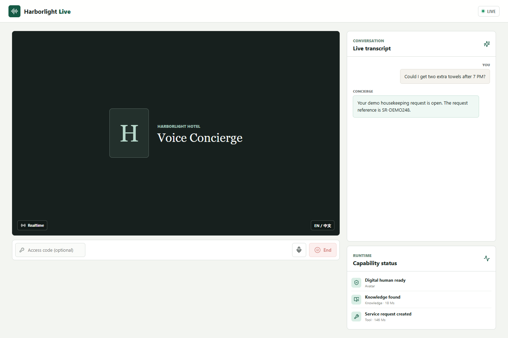
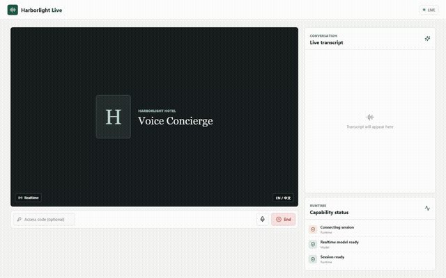
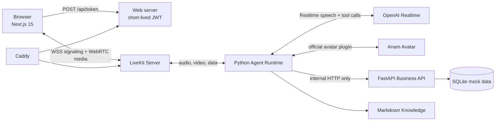

# Realtime AI Voice Agent

A small, runnable reference implementation of a realtime hotel concierge with two-way audio,
live transcription, a provider-hosted digital human, Markdown knowledge retrieval, and typed
business tools. The fictional Harborlight Hotel scenario keeps the engineering visible without
depending on private services or customer data.



The screenshot above is a sanitized preview state. [Watch the 72-second local RTC demo](docs/media/demo.mp4)
or view the short flow below. The recording uses generated fictional speech and no avatar; it proves
the local voice, transcript, Knowledge, reservation, and service-request path without implying a
credentialed Anam acceptance result.



[Media rights notice](MEDIA_NOTICE.md)

## Problem and solution

Realtime voice demos often hide critical boundaries inside one process: browser credentials,
model prompts, database access, avatar state, and operational events. This project separates them:

- Next.js issues short-lived, server-generated LiveKit grants and renders media and status.
- A Python LiveKit Agent owns the Realtime model session, prompt, tools, and avatar adapter.
- A private FastAPI service validates tool inputs and is the only process that reads SQLite.
- Self-hosted LiveKit carries WebRTC media and the public-safe `showcase.status.v1` data channel.
- Caddy terminates HTTPS/WSS while media uses explicit TCP/UDP ports.

## Architecture



The browser never receives provider secrets. The Agent never opens SQLite. Tool telemetry contains
only an allowlisted event name, state, label, sequence, timestamp, and optional duration.

## Demo

Use these fictional records:

| Flow | Demo input | Expected behavior |
| --- | --- | --- |
| Knowledge | "What time is breakfast?" | Searches Markdown and answers from the matched policy |
| Unknown knowledge | "Who painted the lobby artwork?" | Says it cannot verify the answer |
| Reservation | `DEMO-2048`, last name `Morgan` | Returns a confirmed Harbor View King stay |
| Service request | Two towels after 7 PM | Confirms details, then creates an `SR-...` request |

Suggested recording sequence: connect, confirm the avatar track, ask the breakfast question, ask the
unknown question, look up the demo reservation, create the towel request, and end the call. Keep the
final recording between 60 and 75 seconds.

The sanitized UI-only state is available at `/?preview=1` for screenshots. It is not runtime proof.

## Run locally

Requirements: Docker Engine with Compose v2, a browser with microphone permission, an OpenAI API
key, and ports `3000`, `7880`, `7881`, and UDP `50000-50100` available.

1. Create `.env` from `.env.example` and replace the LiveKit secret and OpenAI key.
2. Keep `SHOWCASE_AVATAR_ENABLED=false` for local-only LiveKit.
3. Start the stack without Caddy:

```bash
docker compose -f compose.yaml -f compose.local.yaml up --build web business-api livekit agent
```

4. Open `http://localhost:3000` and start a call.
5. Stop with `Ctrl+C`, then remove only these project containers:

```bash
docker compose -f compose.yaml -f compose.local.yaml down
```

Local mode exercises two-way voice, transcripts, knowledge, tools, and cleanup. The Anam service
must reach the LiveKit URL, so full avatar mode requires a publicly reachable WSS/RTC deployment.

### Run services without Docker

Python requires 3.12 and [uv](https://docs.astral.sh/uv/):

```bash
uv sync --dev
uv run uvicorn business_api.app:app --reload --port 8000
uv run python -m voice_agent.entrypoint dev
```

In a separate terminal, install and start the web app:

```bash
cd web
corepack pnpm install --frozen-lockfile
corepack pnpm dev
```

Place the LiveKit server variables in `web/.env.local` when Next.js runs outside Compose. Keep that
file untracked.

## Full public deployment

Full avatar mode uses two DNS names on one host:

- `APP_DOMAIN` routes HTTPS to Next.js.
- `LIVEKIT_DOMAIN` routes WSS signaling to LiveKit.

Point both A/AAAA records at the server. Open TCP `80`, `443`, `7881`; UDP `443` and
`50000-50100`. Do not proxy the WebRTC media ports through an HTTP CDN. If the host is behind NAT,
forward the same ports and confirm that LiveKit advertises the public address.

Set every non-placeholder value in `.env`, including `ANAM_AVATAR_ID`, then run:

```bash
docker compose up --build -d
docker compose ps
docker compose logs --tail=100 agent livekit caddy
```

Caddy obtains certificates automatically. Before exposing a paid demo, set a strong
`SHOWCASE_ACCESS_CODE`, apply host firewall rules, and add external rate limiting at the edge.

## Environment variables

| Variable | Used by | Purpose |
| --- | --- | --- |
| `LIVEKIT_API_KEY` | Web, Agent, LiveKit | Server-side signing and Agent authentication |
| `LIVEKIT_API_SECRET` | Web, Agent, LiveKit | Server-side signing secret; never sent to the browser |
| `LIVEKIT_URL` | Agent | Internal LiveKit signaling URL |
| `PUBLIC_LIVEKIT_URL` | Web, Avatar | Browser/provider reachable WSS URL |
| `AGENT_NAME` | Web, Agent | Fixed dispatch target; not client controlled |
| `AGENT_HEALTH_PORT` | Agent | Local worker health port; defaults to `8081` |
| `OPENAI_HTTP_PROXY` | Agent | Optional HTTP(S) proxy used only by the Realtime client |
| `OPENAI_API_KEY` | Agent | Realtime provider credential |
| `OPENAI_REALTIME_MODEL` | Agent | Defaults to `gpt-realtime-2.1` |
| `ANAM_API_KEY` | Agent | Avatar provider credential |
| `ANAM_AVATAR_ID` | Agent | Avatar identifier required by the official plugin |
| `ANAM_PERSONA_ID` | None | Optional account-side note; not used by runtime |
| `SHOWCASE_AVATAR_ENABLED` | Agent | Disable avatar for local and CI checks |
| `BUSINESS_API_URL` | Agent | Internal FastAPI base URL |
| `DATABASE_URL` | Business API | SQLite URL; Compose stores it in a named volume |
| `TOOL_TIMEOUT_SECONDS` | Agent | Bounded internal HTTP timeout, 1-30 seconds |
| `MODEL_CONNECT_TIMEOUT_SECONDS` | Agent | Realtime handshake timeout, 5-60 seconds |
| `APP_DOMAIN` | Caddy | Public web hostname |
| `LIVEKIT_DOMAIN` | Caddy, Web, Agent | Public signaling hostname |
| `CADDY_EMAIL` | Caddy | ACME contact |
| `SHOWCASE_ACCESS_CODE` | Web | Optional token endpoint cost gate |
| `LOG_LEVEL` | Python services | `DEBUG`, `INFO`, `WARNING`, or `ERROR` |

The example Realtime model is documented in the
[Realtime guide](https://developers.openai.com/api/docs/guides/realtime) and
[model reference](https://developers.openai.com/api/docs/models/gpt-realtime-2.1).

## Token and API contracts

`POST /api/token` accepts an empty object or `{ "accessCode": "..." }`. It rejects room names,
participant identities, Agent names, and unknown fields. The server generates a random room and
participant, fixes the Agent dispatch, grants only room participation, sets a ten-minute expiry, and
returns `Cache-Control: no-store`.

The private business API exposes:

```text
GET  /health
GET  /v1/reservations/{reference}?last_name=...
POST /v1/service-requests
```

Local examples:

```bash
curl http://localhost:8000/health
curl "http://localhost:8000/v1/reservations/DEMO-2048?last_name=Morgan"
curl -X POST http://localhost:8000/v1/service-requests \
  -H "Content-Type: application/json" \
  -d '{"category":"housekeeping","summary":"Please bring two extra towels.","requested_time":"after 7 PM"}'
```

The production Compose file does not publish port `8000`; only the Agent can reach that service.

## Security model

- All records, names, dates, prompts, and knowledge entries are fictional fixtures.
- Provider credentials exist only in server/Agent process environments.
- Token claims are server-generated, short lived, scoped to one random room, and not cached.
- Reservation lookup requires both reference and last name and does not enumerate by reference.
- The Agent calls typed HTTP endpoints and cannot query the database directly.
- Public telemetry rejects unknown event names and unknown fields; raw tool arguments are never sent.
- JSON logs avoid request bodies, customer fields, provider messages, tokens, and credentials.
- The repository and full Git history are checked by the local scanner and Gitleaks in CI.

This reference still needs deployment-level rate limiting, monitoring, backups, key rotation, and a
formal privacy policy before use with real customer data.

## Validation

```bash
uv sync --dev
uv run ruff check .
uv run ruff format --check .
uv run pytest
uv run python scripts/security_scan.py

cd web
corepack pnpm install --frozen-lockfile
corepack pnpm lint
corepack pnpm typecheck
corepack pnpm test
corepack pnpm build
corepack pnpm exec playwright test
```

Container configuration and builds:

```bash
docker compose --env-file .env.example config --quiet
docker build -f Dockerfile.python -t harborlight-agent:local .
docker build -f web/Dockerfile -t harborlight-web:local web
```

Credential-free CI validates configuration, Prompt invariants, Knowledge matches/no-match behavior,
API validation and persistence, tool failure redaction, official avatar construction, telemetry
allowlisting, token claims, responsive UI, and container builds. A real RTC acceptance run is a
separate bounded operation because it incurs provider cost.

## Project structure

```text
.
|-- deploy/                 # Caddy and LiveKit configuration
|-- docs/media/             # Redacted screenshots and demo video
|-- knowledge/              # Public Markdown knowledge fixtures
|-- scripts/                # Repository and history security scan
|-- src/
|   |-- business_api/       # Typed HTTP boundary and SQLite ownership
|   |-- showcase_shared/    # Settings and structured logging
|   `-- voice_agent/        # Prompt, tools, telemetry, Realtime and avatar assembly
|-- tests/                  # Python unit and integration tests
|-- web/                    # Next.js console, token route, unit and Playwright tests
|-- compose.yaml            # Public deployment topology
`-- compose.local.yaml      # Local, no-avatar override
```

## Limitations

- The SQLite service and one LiveKit node are intentionally small; horizontal scale needs shared
  state, a production database, and LiveKit's distributed deployment design.
- Markdown search is deterministic keyword matching, not semantic retrieval.
- The official avatar plugin is used as provided. This project does not add proprietary stream
  recovery, watchdog, monkey patches, or provider fallbacks.
- Anam avatar mode cannot be proven on an unpublished localhost URL.
- The access code is a cost-control gate, not a replacement for user authentication or rate limits.

## Troubleshooting

**The page connects but audio does not flow:** confirm microphone permission, HTTPS on public hosts,
TCP `7881`, and UDP `50000-50100`. Inspect browser WebRTC diagnostics and LiveKit logs.

**The digital human never appears:** verify `SHOWCASE_AVATAR_ENABLED=true`, the avatar ID (not a
persona ID), provider credentials, and that `PUBLIC_LIVEKIT_URL` is publicly reachable.

**No Agent joins:** ensure the same `AGENT_NAME` is configured in Web and Agent containers. Check
that the Agent registered before issuing a new token.

**Tools report unavailable:** confirm `business-api` is healthy and the Agent uses
`http://business-api:8000`. The API is intentionally unreachable from the public network.

## License

Source code is MIT licensed. Avatar, voice, persona, trademark, and demonstration-media rights are
separately limited by [MEDIA_NOTICE.md](MEDIA_NOTICE.md).
