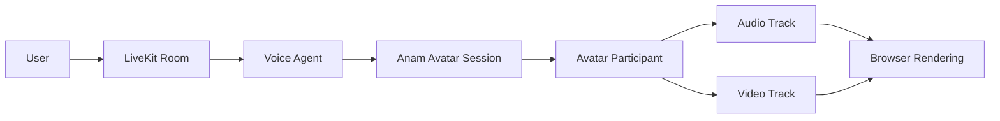

# Optional Avatar Validation

## Status

**P0.1 Optional Enhancement - pending public RTC acceptance**

The P0 Core Release is the Realtime AI Voice Agent reference implementation. Its validated scope is
LiveKit/WebRTC voice, Realtime LLM integration, Knowledge retrieval, Tool calling, the Mock Business
API, lifecycle handling, Web UI, tests, CI, security controls, documentation, and demo media.

Optional Anam support remains implemented through the official LiveKit plugin. It is not a P0 Core
Release blocker and is not presented as production-validated.

## Current blocker

Public LiveKit RTC environment with matching signing credentials is currently unavailable.

Local-only LiveKit is sufficient for the core voice path but cannot complete a provider-hosted
Avatar session that must join a publicly reachable room. No private hostname, signing key, provider
credential, or account identifier is stored in this repository.

## Recorded prototype footage

Avatar footage from the underlying working prototype may be used as portfolio evidence only when it
is clearly labeled **Recorded prototype demo** or **Demo footage from the underlying working
prototype**. It demonstrates prior working behavior; it does not claim that a default clone of this
public repository immediately reproduces the third-party Avatar path.

## Validation path

## Test procedure

1. Provision a public LiveKit WSS endpoint with reachable TCP and UDP media ports.
2. Inject matching LiveKit signing credentials and Anam credentials only into bounded process
   environments.
3. Use a unique Agent name, a random fictional room, and generated test speech.
4. Start the Business API, LiveKit Agent, and Web UI without printing environment values.
5. Connect from the browser, exercise speech, and observe participant and track events.
6. Disconnect and reconnect once, then verify all provider and room resources are released.
7. Store only redacted event results and approved media.

## Acceptance criteria

- [ ] Avatar participant joins the room.
- [ ] Avatar audio track is published.
- [ ] Avatar video track is published.
- [ ] Browser receives and renders the video track.
- [ ] Lip synchronization is visibly aligned with generated speech.
- [ ] Session disconnect and reconnect complete without orphaned resources.
- [ ] No secrets, internal domains, node identifiers, or provider credentials are exposed.

Until every item passes in one bounded public RTC run, the repository must describe Avatar support
as an optional integration rather than a production-validated capability.
